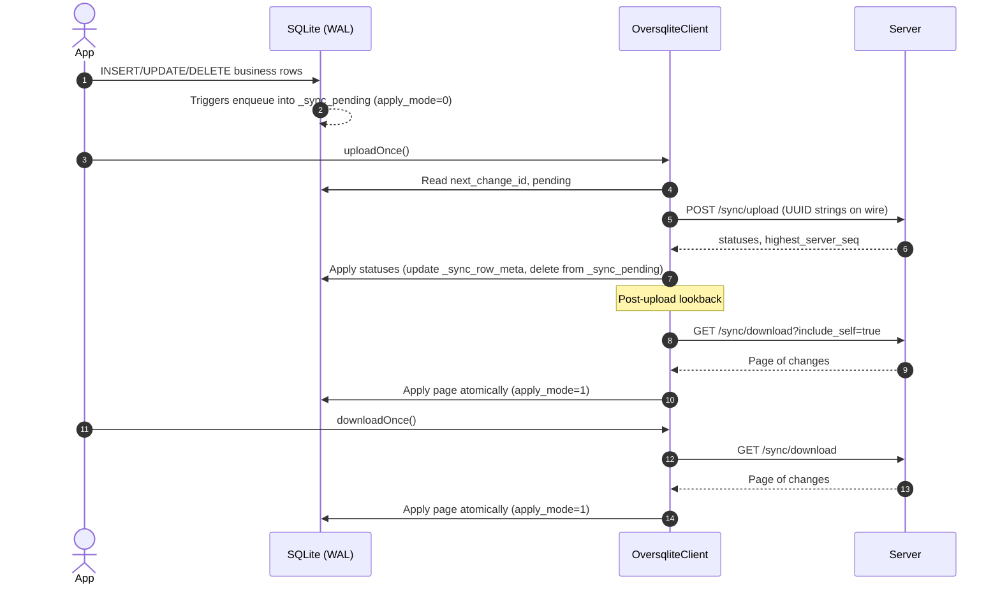

# SQLiteNow KMP Library – Technical Flow & Protocol Specification

This document explains the SQLiteNow ("sqlitenow") synchronization client library for Kotlin
Multiplatform (KMP). It is written so another engineer can implement a compatible client in a
different language without learning the original KMP code.

## Table of Contents

- [1. Concepts and Data Model](#1-concepts-and-data-model)
- [2. Local Tables & Metadata Schema](#2-local-tables--metadata-schema)
- [3. Client Lifecycle](#3-client-lifecycle)
- [4. Upload Protocol](#4-upload-protocol)
- [5. Download Protocol](#5-download-protocol)
- [6. Conflict Resolution Model](#6-conflict-resolution-model)
- [7. Post-Upload Lookback Window](#7-post-upload-lookback-window)
- [8. Server API Contracts](#8-server-api-contracts)
- [9. Pseudocode Reference](#9-pseudocode-reference)
- [10. Operational Notes & Logging](#10-operational-notes--logging)

---

## 1. Concepts and Data Model

### Core Concepts

- **Business tables**: User-defined tables (e.g., `users`) holding application data
- **Metadata tables**: Private tables used by the sync engine to track state per-row and per-client
- **Pending queue**: Local operations to send to server (`INSERT`/`UPDATE`/`DELETE`)
- **Server version**: Monotonically increasing version assigned by server per row on each change
- **Client source id**: Stable unique id for this device/client assigned at bootstrap time
- **Watermark (last_server_seq_seen)**: A cursor into the server change stream

### Data Flow Overview

A client keeps metadata for every known row and queues local mutations to upload. The server owns
truth of the global change log and versions. The system uses optimistic concurrency control with
client-side conflict resolution.

---

## 2. Local Tables & Metadata Schema

The library uses three core metadata tables:

### 2.1 Client Info Table

```sql
CREATE TABLE IF NOT EXISTS _sync_client_info (
  user_id TEXT NOT NULL PRIMARY KEY,
  source_id TEXT NOT NULL,
  next_change_id INTEGER NOT NULL DEFAULT 1,
  last_server_seq_seen INTEGER NOT NULL DEFAULT 0,
  apply_mode INTEGER NOT NULL DEFAULT 0,
  current_window_until INTEGER NOT NULL DEFAULT 0
);
```

### 2.2 Row Metadata Table

```sql
CREATE TABLE IF NOT EXISTS _sync_row_meta (
  table_name TEXT NOT NULL,
  pk_uuid    TEXT NOT NULL,            -- primary key value (text; hex for BLOB UUIDs)
  server_version INTEGER NOT NULL DEFAULT 0,
  deleted    INTEGER NOT NULL DEFAULT 0,
  updated_at TEXT NOT NULL DEFAULT (strftime('%Y-%m-%dT%H:%M:%fZ','now')),
  PRIMARY KEY (table_name, pk_uuid)
);
```

### 2.3 Pending Changes Table

```sql
CREATE TABLE IF NOT EXISTS _sync_pending (
  table_name  TEXT NOT NULL,
  pk_uuid     TEXT NOT NULL,
  op          TEXT NOT NULL CHECK (op IN ('INSERT','UPDATE','DELETE')),
  base_version INTEGER DEFAULT 0,
  payload     TEXT,
  change_id   INTEGER,
  queued_at   TEXT NOT NULL DEFAULT (strftime('%Y-%m-%dT%H:%M:%fZ','now')),
  PRIMARY KEY (table_name, pk_uuid)
);
```

### 2.4 Recommended Indexes

```sql
CREATE INDEX IF NOT EXISTS idx_pending_time ON _sync_pending(queued_at);
CREATE INDEX IF NOT EXISTS idx_row_meta ON _sync_row_meta(table_name, pk_uuid);
```

### 2.5 Database Triggers

Triggers are the heart of SQLiteNow - they automatically capture all local changes and queue them
for synchronization. The library installs BLOB-aware triggers for each sync table that:

- Guard on `apply_mode=0` to suppress triggers during download/apply
- Maintain `_sync_row_meta` (set/reset deleted, keep server_version)
- Coalesce operations (e.g., UPDATE after INSERT remains INSERT)
- Increment `next_change_id` when a pending row changes
- For BLOB UUID primary keys, use `lower(hex(pk))` as the local `pk_uuid` and render BLOB columns as
  hex in JSON payloads; on the wire, PKs are UUID strings and other BLOB columns are Base64

The following examples are conceptual; the installed triggers include the additional safeguards and
coalescing outlined above.

#### INSERT Trigger (conceptual)

```sql
CREATE TRIGGER IF NOT EXISTS sync_insert_users
AFTER INSERT ON users
FOR EACH ROW
WHEN (SELECT apply_mode FROM _sync_client_info LIMIT 1) = 0
BEGIN
  INSERT INTO _sync_pending (
    queued_at, table_name, pk_uuid, op, base_version, payload, change_id
  ) VALUES (
    (strftime('%s', 'now') * 1000),  -- current timestamp in milliseconds
    'users',
    NEW.id,
    'INSERT',
    0,  -- base_version is 0 for new records
    json_object('id', NEW.id, 'name', NEW.name, 'email', NEW.email),
    NULL  -- change_id assigned later during upload
  );
END;
```

#### UPDATE Trigger (conceptual)

```sql
CREATE TRIGGER IF NOT EXISTS sync_update_users
AFTER UPDATE ON users
FOR EACH ROW
WHEN (SELECT apply_mode FROM _sync_client_info LIMIT 1) = 0
BEGIN
  INSERT INTO _sync_pending (
    queued_at, table_name, pk_uuid, op, base_version, payload, change_id
  ) VALUES (
    (strftime('%s', 'now') * 1000),
    'users',
    NEW.id,
    'UPDATE',
    COALESCE((SELECT server_version FROM _sync_row_meta
              WHERE table_name = 'users' AND pk_uuid = NEW.id), 0),
    json_object('id', NEW.id, 'name', NEW.name, 'email', NEW.email),
    NULL
  );
END;
```

#### DELETE Trigger (conceptual)

```sql
CREATE TRIGGER IF NOT EXISTS sync_delete_users
AFTER DELETE ON users
FOR EACH ROW
WHEN (SELECT apply_mode FROM _sync_client_info LIMIT 1) = 0
BEGIN
  INSERT INTO _sync_pending (
    queued_at, table_name, pk_uuid, op, base_version, payload, change_id
  ) VALUES (
    (strftime('%s', 'now') * 1000),
    'users',
    OLD.id,
    'DELETE',
    COALESCE((SELECT server_version FROM _sync_row_meta
              WHERE table_name = 'users' AND pk_uuid = OLD.id), 0),
    NULL,  -- DELETE operations have no payload
    NULL
  );
END;
```

#### 2.6 Hex Encoding for BLOB UUID Primary Keys

Some apps store UUID primary keys as BLOB(16). To keep triggers and metadata simple and portable:

- Locally, the client stores `pk_uuid` as a lowercase hex string of the UUID bytes.
- On the wire, the primary key is a UUID string (e.g., `550e8400-e29b-41d4-a716-446655440000`).
- Non-PK BLOB columns are represented as Base64 in payloads on the wire.

Trigger expressions must therefore use a PK-aware expression:

```sql
-- If PK is BLOB UUID (recommended for triggers):
--   pk_expr_new = lower(hex(NEW.id))
--   pk_expr_old = lower(hex(OLD.id))
-- If PK is TEXT (UUID string):
--   pk_expr_new = NEW.id
--   pk_expr_old = OLD.id
```

The installed triggers compute the correct expression based on table schema. The JSON payload built
in triggers renders BLOB columns as hex for local persistence; the client converts these to Base64
for non-PK BLOB columns and to UUID string for BLOB UUID primary keys when sending to the server.

Why hex locally?

- Uniform metadata: `_sync_row_meta.pk_uuid` is always text, independent of PK column storage.
- Simple joins and lookups in metadata without custom collations or binary handling.
- Lossless mapping: hex ↔ bytes is exact and cheap.

#### Key Trigger Design Elements

**1. apply_mode Guard Condition**

```sql
WHEN (SELECT apply_mode FROM _sync_client_info LIMIT 1) = 0
```

- Prevents infinite loops when sync system applies downloaded changes
- When `apply_mode = 1`, triggers are disabled (sync is applying remote changes)
- When `apply_mode = 0`, triggers are active (user is making local changes)

**2. Base Version Lookup**

```sql
COALESCE((SELECT server_version FROM _sync_row_meta
          WHERE table_name = 'users' AND pk_uuid = NEW.id), 0)
```

- Gets the current server version for optimistic concurrency control
- Uses 0 if no metadata exists (new record)
- Critical for conflict detection on the server

**3. JSON Payload Construction & Binary Columns**

```sql
json_object('id', NEW.id, 'name', NEW.name, 'email', NEW.email)
```

- Captures complete record state for INSERT/UPDATE operations; NULL for DELETE operations
- For BLOB PKs (UUID stored as BLOB), local `pk_uuid` is lowercase hex; on the wire, the PK is a
  UUID string
- Non-PK BLOB columns are encoded as Base64 in payloads on the wire

**4. Timestamp Precision**

```sql
(strftime('%s', 'now') * 1000)
```

- Millisecond precision for proper ordering
- Ensures FIFO processing of changes

---

## 3. Client Lifecycle

### 3.1 Bootstrap

1. Generate `source_id` if missing (UUID)
2. Initialize `_sync_client_info` with:
    - `next_change_id = 1`
    - `last_server_seq_seen = 0`
    - `apply_mode = 0` (triggers enabled)
3. Ensure metadata tables exist
4. **Create triggers for all business tables** that need synchronization
5. Create sync system tables for business tables with `enableSync=true` annotation
6. Clear any cached table-info for this database before (re)installing triggers to avoid stale
   schema information

### 3.2 Hydrate (Initial/Full Recovery)

- Rebuild local state by downloading all remote changes from `last_server_seq_seen` until stream end
- Use `includeSelf = true` if this client previously uploaded data you must reconcile into fresh
  state
- Apply pages until `hasMore = false`, persist new `last_server_seq_seen`

---

## 4. Upload Protocol

### 4.1 Automatic Change Capture via Triggers

**SQLiteNow automatically captures all local changes through database triggers.** You don't manually
queue changes - the triggers do it for you.

**When User Makes Changes:**

```sql
-- User performs normal database operations:
INSERT INTO users (id, name, email) VALUES ('uuid-123', 'Alice', 'alice@example.com');
UPDATE users SET name = 'Alice Smith' WHERE id = 'uuid-123';
DELETE FROM users WHERE id = 'uuid-123';
```

**Triggers Automatically Queue Changes:**

- INSERT trigger captures the new record and queues INSERT operation
- UPDATE trigger captures the modified record and queues UPDATE operation
- DELETE trigger captures the deleted record ID and queues DELETE operation
- All with proper base_version for conflict detection

**No Manual Intervention Required:**

- Developers write normal SQL - triggers handle sync automatically
- Base versions are looked up automatically from `_sync_row_meta`
- JSON payloads are constructed automatically from record data
- Timestamps ensure proper ordering of operations

### 4.2 Assign Change IDs (Just-in-Time)

Before sending a batch:

```sql
-- Get next change ID
SELECT next_change_id FROM _sync_client_info LIMIT 1

-- Assign sequential IDs to pending changes
UPDATE _sync_pending SET change_id = ? WHERE change_id IS NULL

-- Update next change ID counter
UPDATE _sync_client_info SET next_change_id = ?
```

### 4.3 Upload Request Format (Client → Server)

```json
{
  "last_server_seq_seen": 12345,
  "changes": [
    {
      "source_change_id": 17,
      "schema": "business",
      "table": "users",
      "op": "UPDATE",
      "pk": "uuid-string",
      "server_version": 2,
      "payload": { }
    }
  ]
}
```

Notes:
- The client maintains row identifiers in local format (text; hex for BLOB UUID PKs) for all
  database work. Immediately before the HTTP call, it converts PKs to wire format (UUID string) in
  the request body.

### 4.4 Upload Response Format (Server → Client)

```json
{
  "statuses": [
    {
      "source_change_id": 17,
      "status": "applied|conflict|invalid|materialize_error",
      "new_server_version": 3,
      "server_row": { },
      "message": "...",
      "invalid": { "reason": "fk_missing|bad_payload|..." }
    }
  ],
  "highest_server_seq": 668501
}
```

### 4.5 Client Handling of Upload Responses

For each status in the response:

#### Applied Status

```sql
-- Update row metadata with new server version
UPDATE _sync_row_meta SET
  server_version = ?,
  deleted = ?  -- 1 for DELETE, 0 for INSERT/UPDATE
WHERE table_name = ? AND pk_uuid = ?

-- Remove from pending queue
DELETE FROM _sync_pending WHERE table_name = ? AND pk_uuid = ?
```

#### Conflict Status

1. Run conflict resolution (see Section 6)
2. If `AcceptServer`: Apply `serverRow` locally, update metadata, drop pending
3. If `KeepLocal`: Update metadata and re-enqueue with new `base_version`

#### Invalid/Materialize Error Status

- Log error and surface to application
- Do not drop pending unless policy dictates

---

## 5. Download Protocol

### 5.1 Download Request (Client → Server)

```
GET /sync/download?after=<last_server_seq_seen>&limit=<N>&include_self=<bool>&schema=<name>[&until=<seq>]
```

Parameters:

- `after`: Client's current watermark (`last_server_seq_seen`)
- `limit`: Maximum number of changes to return
- `include_self`: Whether to include changes from this client's `source_id`
- `until`: Optional frozen upper bound for windowed hydration
- `schema`: Logical schema name (e.g., "business")

### 5.2 Download Response (Server → Client)

```json
{
  "changes": [
    {
      "op": "INSERT|UPDATE|DELETE",
      "table": "users",
      "pk": "uuid-string",
      "server_version": 3,
      "payload": { },
      "source_id": "device-uuid"
    }
  ],
  "next_after": 668501,
  "has_more": false,
  "window_until": 0
}
```

### 5.3 Applying Download Pages

Process changes in a single transaction with triggers disabled:

```pseudocode
BEGIN;
SET apply_mode = 1;  // suppress triggers

for change in page:
  if (!include_self && change.source_id == client.source_id) continue

  // Resolve PK binding by column type.
  // If PK column type contains 'BLOB', bind Blob(UUID.fromString(change.pk).toBytes())
  // else bind Text(change.pk)

  if (change.op == DELETE):
    DELETE FROM <table> WHERE <pk_col> = :pk
    UPSERT _sync_row_meta(table_name, pk_uuid, server_version, deleted=1)
  else:  // INSERT/UPDATE
    UPSERT business row from change.payload  // triggers suppressed by apply_mode
    UPSERT _sync_row_meta(table_name, pk_uuid, server_version, deleted=0)

  // Advance watermark if next_after > previous_after
SET last_server_seq_seen = response.next_after

SET apply_mode = 0;  // re-enable triggers
COMMIT;
```

Post-upload lookback (internal): During a short window after uploads, the client downloads a bounded
range including self to ensure metadata (especially deletes) is consistent. It uses a version check
keyed by the correct local PK format (hex for BLOB UUID PKs) to avoid applying stale changes. The
client also skips intermediate DELETEs that are superseded by later INSERT/UPDATE for the same row
within the same page.

**Why apply_mode is Essential:**

- When `apply_mode = 1`: Triggers are disabled, sync system is applying remote changes
- When `apply_mode = 0`: Triggers are active, capturing user's local changes
- Without this, applying downloaded changes would trigger new pending changes, creating infinite
  loops

---

## 6. Conflict Resolution Model

Conflicts arise when the server's current version differs from the client's `serverVersion` (
base_version) in an upload.

### 6.1 SQLiteNow Conflict Resolution Policy

```pseudocode
function resolveConflictWithFallbacks(localOp, serverRow, localPayload):
  // CRITICAL: DELETE operations always win to prevent record resurrection
  if localOp == "DELETE":
    return KeepLocal(null)

  // Handle infrastructure edge cases
  if localPayload == null:
    return AcceptServer

  if serverRow == null:
    return KeepLocal(localPayload)

  // Delegate to application resolver for business conflicts
  return applicationResolver.merge(table, pk, serverRow, localPayload)
```

### 6.2 Processing KeepLocal Decision

```sql
-- Update metadata to reflect server's current version
UPDATE _sync_row_meta SET
  server_version = ?, -- conflict.newServerVersion
  deleted = ?         -- 1 if op==DELETE, 0 otherwise
WHERE table_name = ? AND pk_uuid = ?;

-- Re-enqueue local change with updated base_version
UPDATE _sync_pending SET
  base_version = ?    -- conflict.newServerVersion
WHERE change_id = ?;
```

### 6.3 Processing AcceptServer Decision

```sql
-- Apply server's canonical row
INSERT OR REPLACE INTO <business_table> (...) VALUES (...);

-- Update metadata
UPDATE _sync_row_meta SET
  server_version = ?,
  deleted = 0
WHERE table_name = ? AND pk_uuid = ?;

-- Remove pending change
DELETE FROM _sync_pending WHERE change_id = ?;
```

---

## 7. Post-Upload Lookback Window

### 7.1 Problem It Solves

- Uploading can advance server cursor beyond peer changes that were just behind your previous
  watermark
- After resolving conflicts, uploader needs to see its own accepted changes to synchronize local
  metadata
- Critical for DELETE operations to prevent metadata inconsistency

### 7.2 Lookback Algorithm (High-Level)

**The Problem:** After uploading changes, you might miss peer changes that arrived just before your
upload.

**The Solution:** Temporarily go backward in time and re-download recent changes.

**How It Works:**

1. Remember your current position in the server's change stream
2. Jump backward by ~1000-2000 changes
3. Download forward again with `includeSelf=true` until you reach your original position
4. This catches any missed changes AND lets you see your own uploaded changes

**Why includeSelf=true is Safe:**

- Only applies changes that are newer than what you already have locally
- DELETE operations only update metadata, never overwrite business data
- Prevents the metadata inconsistency bug we fixed

### 7.3 Safety of includeSelf=true During Lookback

During post-upload lookback with `isPostUploadLookback=true`:

```pseudocode
function handleNormalApply(change, isPostUploadLookback):
  if isPostUploadLookback:
    currentVersion = SELECT server_version FROM _sync_row_meta
                    WHERE table_name = change.table AND pk_uuid = change.pk

    if change.serverVersion > currentVersion:
      // Only apply if server version is newer
      applyChange(change)
      updateRowMeta(change.serverVersion)
    else:
      // Skip stale changes - prevents overwriting with old data
      skip()
  else:
    // Normal download - apply without version checking
    applyChange(change)
    updateRowMeta(change.serverVersion)
```

This ensures:

- DELETE operations only update metadata (no business data corruption risk)
- INSERT/UPDATE operations are only applied if they're newer than current local version
- Devices can see their own uploaded changes to maintain metadata consistency

---

## 8. Server API Contracts

### 8.1 Upload Endpoint

**POST** `/sync/upload`

**Request Headers:**

```
Authorization: Bearer <token>
Content-Type: application/json
```

**Request Body:** See Section 4.3

**Response Body:** See Section 4.4

**Server Responsibilities:**

- Maintain global ordered change-log with increasing sequence numbers
- Assign per-row versions that increase monotonically
- Detect conflicts by comparing `serverVersion` (base) against current row version
- Never perform business conflict resolution—return information for client to decide
- For applied changes: persist to database and assign new `serverVersion`
- For conflicts: return current `serverRow` and `newServerVersion`

### 8.2 Download Endpoint

**GET** `/sync/download`

**Query Parameters:**

- `after`: Client's watermark (required)
- `limit`: Max changes to return (required)
- `includeSelf`: Include client's own changes (boolean)
- `schema`: Logical schema name (required)
- `until`: Optional upper bound for windowing

**Response Body:** See Section 5.2

**Server Responsibilities:**

- Return changes in chronological order by server sequence
- Respect `includeSelf` parameter by filtering on `sourceId`
- Set `hasMore=true` if more changes exist beyond the returned page
- Provide accurate `nextAfter` for client watermark advancement

---

## 9. Pseudocode Reference

### 9.1 Enqueue Local Change

```pseudocode
function enqueueLocalChange(table, pk, op, payload):
  // Get current server version for this row
  baseVersion = SELECT server_version FROM _sync_row_meta
                WHERE table_name = table AND pk_uuid = pk
                DEFAULT 0

  // Queue the change
  INSERT INTO _sync_pending (
    queued_at, table_name, pk_uuid, op, base_version, payload, change_id
  ) VALUES (
    currentTimeMillis(), table, pk, op, baseVersion,
    (op == "DELETE" ? null : jsonSerialize(payload)),
    null  // assigned later
  )
```

### 9.2 Upload Flow (Simplified)

**Step 1: Prepare Changes**

- Get all pending changes from `_sync_pending` table
- Assign unique change IDs for tracking responses
- Convert to JSON format for HTTP request

**Step 2: Send to Server**

- POST to `/sync/upload` with array of changes
- Each change includes: operation type, table, primary key, expected server version, and data
  payload

**Step 3: Process Server Response**

- Server returns status for each change: APPLIED, CONFLICT, or ERROR
- For APPLIED: Update local metadata and remove from pending queue
- For CONFLICT: Run conflict resolution logic (see Section 6)
- For ERROR: Log and potentially retry

**Step 4: Handle Conflicts**

- DELETE vs UPDATE: Always choose DELETE to prevent record resurrection
- Other conflicts: Use application-specific resolver or safe defaults
- Re-queue resolved changes with updated server version

### 9.3 Download Flow (Simplified)

**Step 1: Request Changes**

- Ask server for changes after your current watermark position
- Specify whether to include your own changes (`includeSelf`)
- Server returns a page of changes in chronological order

**Step 2: Filter Changes**

- Skip your own changes if `includeSelf=false` (normal downloads)
- Include your own changes if `includeSelf=true` (hydrate, lookback)

**Step 3: Apply Changes**

- For DELETE: Remove record from business table, mark as deleted in metadata
- For INSERT/UPDATE: Upsert record to business table, update metadata
- During lookback: Only apply changes newer than your current version

**Step 4: Update Watermark**

- Save the new position in server's change stream
- This ensures you don't re-download the same changes next time

### 9.4 The Critical DELETE vs UPDATE Conflict Fix

**The Problem We Solved:**
When Device A deletes a record while Device B updates the same record, the original system would "
resurrect" the deleted record on Device A.

**Root Cause:**
DELETE operations have no payload data, so the conflict resolver automatically chose "AcceptServer",
causing the server's updated version to overwrite the local DELETE.

**The Fix (as implemented):**

- Prefer local DELETE in conflict paths; ensure the business row is deleted locally with PK-type
  aware binding (BLOB UUID vs TEXT).
- Update `_sync_row_meta` to reflect the server version (deleted=1), so subsequent lookbacks do not
  resurrect the row.
- Update the pending DELETE to use the server's version as the new `base_version` when retrying.
- Post-upload lookback is performed (including self) with a version check using the correct local
  PK format (hex for BLOB UUIDs), and with an optimization to skip intermediate DELETEs superseded
  by later changes in the same page.

**Why This Works:**

- Prevents record resurrection by ensuring DELETEs always win
- Maintains data consistency across all devices
- Server still validates the DELETE against current version
- Other devices receive and apply the DELETE correctly

---

## 11. Diagrams (Mermaid)

### 11.1 Incremental Sync (Upload → Lookback → Download)



### 11.2 Encoding Map

```mermaid
flowchart LR
  A[PK in business table] -->|BLOB(16)| B[Local pk_uuid = hex(bytes)]
  A -->|TEXT (UUID string)| C[Local pk_uuid = text]
  B --> D[Wire PK = UUID string]
  C --> D
  E[Non-PK BLOB columns] --> F[Local JSON payload = hex]
  F --> G[Wire payload = Base64]
```

---

## 10. Operational Notes & Logging

### 10.1 High-Level Flow Overview

#### The Complete Sync Cycle

1. **Local Changes**: User modifies data → **Triggers automatically queue** changes in
   `_sync_pending`
2. **Upload**: Send queued changes to server → Server responds with APPLIED/CONFLICT
3. **Conflict Resolution**: For conflicts, decide AcceptServer or KeepLocal → Re-queue if needed
4. **Post-Upload Lookback**: Download a bounded recent window (including self) to catch missed
   updates and sync metadata; skip intermediate DELETEs that are superseded by later changes in the
   same page
5. **Download**: Fetch new changes from other devices → Apply with **triggers disabled** to prevent
   loops

#### Key Decision Points

**When Upload Gets CONFLICT Response:**

- If local operation is DELETE: Always choose DELETE (prevent resurrection)
- If local payload is missing: Accept server version
- Otherwise: Use application-specific conflict resolver

**When to Use includeSelf=true:**

- During initial hydrate (rebuilding from scratch)
- During post-upload lookback (to sync metadata after conflicts)
- Never during normal user-initiated downloads

**When Post-Upload Lookback Runs:**

- After every successful upload batch
- Looks backward in time to catch changes that arrived just before upload
- Critical for DELETE operations to maintain metadata consistency

### 10.2 Testing Strategy

#### Essential Test Scenarios

**1. DELETE vs UPDATE Conflict (Most Critical)**

- Device A and B both have the same record
- Device B updates the record and syncs (server version becomes 2)
- Device A deletes the record and syncs (conflicts with version 2)
- Expected: DELETE wins, record is deleted on both devices
- Verify: Both devices show the record as deleted with same server version

**2. Concurrent Operations**

- Multiple devices making different changes simultaneously
- Verify all changes eventually propagate to all devices
- Check that no data is lost or corrupted

**3. Network Interruptions**

- Simulate upload/download failures at various points
- Ensure pending changes are preserved and retried
- Verify watermark consistency after reconnection

**4. Metadata Consistency**

- After any conflict resolution, all devices should have identical metadata
- Server versions should match across devices for the same records
- Deleted flags should be consistent

### 10.3 Performance Considerations

#### Batch Sizes

- Upload: Typically 50-100 changes per batch
- Download: 1000 changes per page (configurable)
- Lookback window: `max(1000, 2 * downloadLimit)`

#### Database Optimization

- Use transactions for multi-change operations
- Index `_sync_pending` by `queued_at` for FIFO processing
- Index `_sync_row_meta` by `(table_name, pk_uuid)` for fast lookups

#### Network Optimization

- Compress JSON payloads for large uploads/downloads
- Use HTTP/2 for connection multiplexing
- Implement exponential backoff for retries

### 10.4 Error Handling

#### Upload Errors

- `invalid`: Log error, surface to application, optionally drop pending
- `materialize_error`: Server-side processing error, retry with backoff
- Network errors: Retry with exponential backoff, preserve pending queue

#### Download Errors

- Network errors: Retry with backoff, don't advance watermark
- Parse errors: Log and skip malformed changes
- Database errors: Rollback transaction, surface error

#### Conflict Resolution Errors

- Always prefer safe fallbacks (AcceptServer for unknown cases)
- Log all conflict decisions for debugging
- Never drop pending changes without explicit resolution
